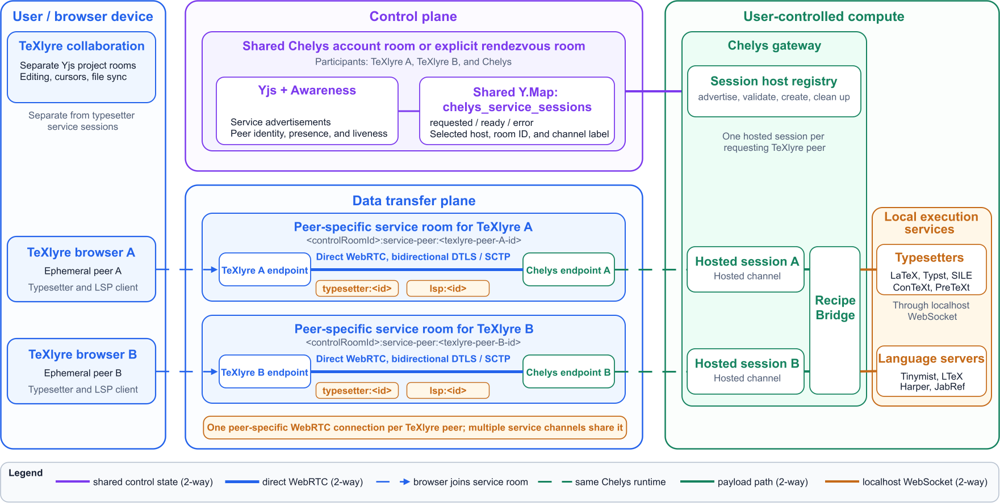

# Chelys

A local desktop companion app for **[TeXlyre](https://github.com/TeXlyre/texlyre)**. Chelys runs the local tooling that a browser cannot, such as language servers and typesetting engines, and keeps your TeXlyre account synchronized across your devices over peer-to-peer connections. Built with Tauri, Rust, React, TypeScript, and Yjs.

[](https://github.com/TeXlyre/chelys/releases/latest)
[](https://github.com/TeXlyre/chelys-recipes)
[](https://www.gnu.org/licenses/agpl-3.0)
[](https://v2.tauri.app/)
[](https://www.rust-lang.org/)
[](https://www.typescriptlang.org/)



> **Status:** This is the [third phase (Tasks 2,3 & 5)](https://texlyre.github.io/blog/nlnet-ngi0-funding-overview#task-2-chelys-proof-of-concept-local-lsp-bridge) of development, currently covering language server and typesetting engine setup, with a WebRTC bridge for local tool sharing. Distributed storage are planned as per the [project scope](https://texlyre.github.io/blog/nlnet-ngi0-funding-overview).

## Features

### Local Tooling

Chelys installs and runs **recipes**, which are background tools such as language servers and typesetting engines. A recipe runs either as a native **system** process or inside a **Docker** container. Chelys manages its lifecycle and exposes it to TeXlyre over a local WebSocket or WebRTC endpoint.

Ready-made recipes are available at [chelys-recipes](https://texlyre.github.io/chelys-recipes). Chelys automates this setup, but it is optional. If you prefer, you can run a language server yourself and point TeXlyre at its WebSocket address directly, following [Using an LSP with TeXlyre](https://texlyre.github.io/docs/lsp-with-texlyre).

### Account Synchronization

Your TeXlyre settings, properties, secrets, and records synchronize directly between your devices using **[Yjs](https://github.com/yjs/yjs) CRDTs** over **WebRTC** without a central server storing data. A presence indicator shows which of your devices are currently connected in Chelys.

### Secure Pairing

Chelys pairs with your existing TeXlyre identity using your username, password, and a **WebAuthn/PRF** passkey or a generated temporary pseudo-PRF key to derive an encrypted account room. Credentials are stored in your operating system's native keychain.

## Quick Start

Download the latest build for your platform from the [Releases](https://github.com/TeXlyre/chelys/releases) page:

* **macOS**: `.dmg` (Apple Silicon and Intel). Note that several typesetter recipes do not support `arm64` architectures.
* **Windows**: `.msi` or `.exe` (release workflow creates `msixbundle` as an artifact)
* **Linux**: `.AppImage` or `.deb`

Open Chelys and sign in with your TeXlyre account.

Some recipes require additional tools to be installed on your system:

* **Docker recipes** require [Docker](https://docs.docker.com/get-docker/).
* **System recipes** may require [Rust/Cargo](https://www.rust-lang.org/tools/install) if they install Rust-based tools.
* On **Windows**, Cargo-based recipes may also require Microsoft C++ Build Tools.

For durther setup commands, see [INSTALL.md](INSTALL.md).

## Build from Source

Requires [Node.js](https://nodejs.org/) LTS, the [Rust toolchain](https://www.rust-lang.org/tools/install), and [Tauri's system prerequisites](https://v2.tauri.app/start/prerequisites/). All typesetter recipes require [Docker](https://docs.docker.com/get-docker/).

```bash
git clone --recursive https://github.com/TeXlyre/chelys.git
cd chelys
npm install
npm run tauri build    # produce a release build
npm run tauri dev      # run in development
```

The output executable is found in `./src-tauri/target/release/Chelys*`

## License

Chelys is licensed under the GNU Affero General Public License v3.0 (AGPL-3.0).
See [LICENSE](https://github.com/TeXlyre/chelys/blob/main/LICENSE) for the complete license text.

## Funding

[Chelys is funded by NLnet](https://nlnet.nl/project/Texlyre/) through the NGI0 Commons Fund, which is supported by the European Commission's Next Generation Internet programme.
